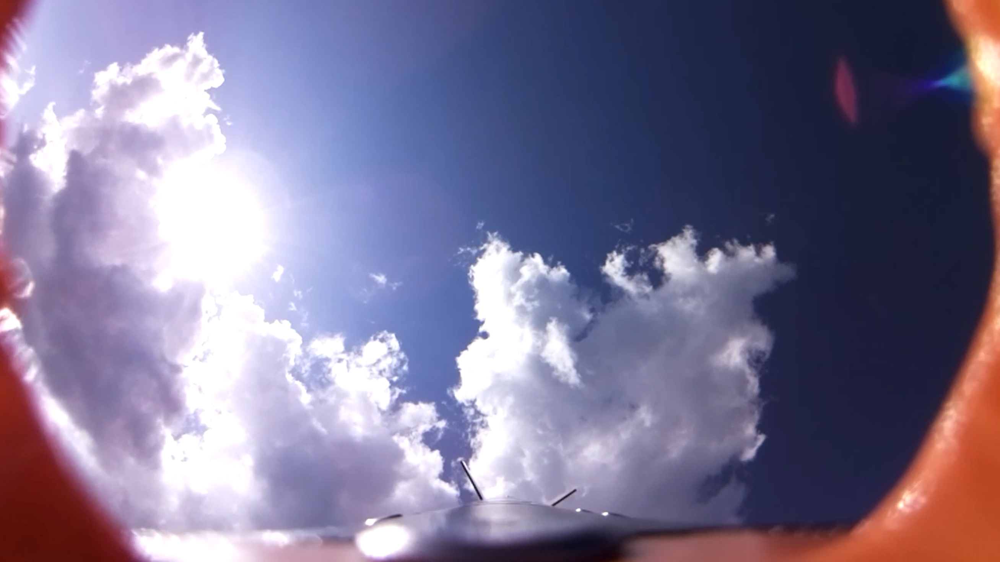
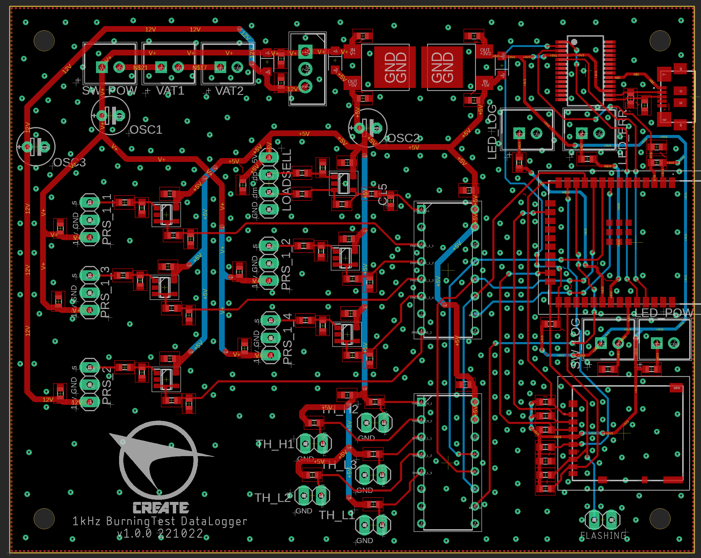
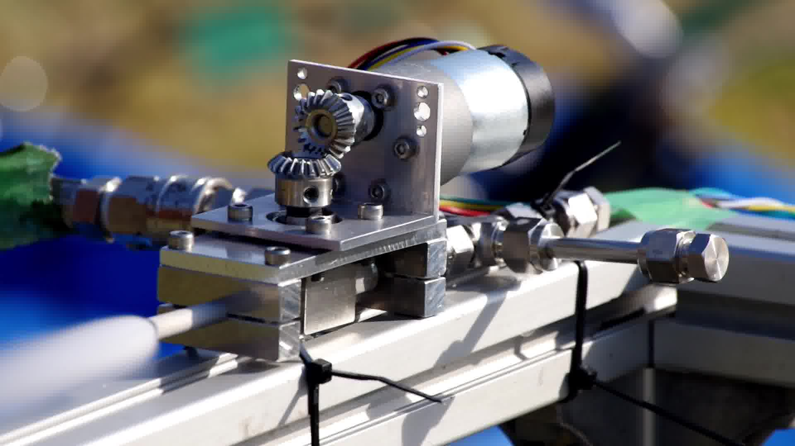

## 自己紹介

所属: 東京工業大学 工学院機械系 学士3年

スキル: C++，Linux，Git，Autodesk Inventor，Autodesk Eagle，RTOS

## 2021.4~ ロケットサークル CREATE

### ロケット搭載 映像撮影システムの開発 (2021.4~2022.11)

ESP32上のfreeRTOS、raspberry pi cameraを制御し，飛行中に映像を撮影．
2022年11月に飛行し、飛行中の動画の撮影に成功．

ソース・ドキュメント：https://github.com/CREATE-ROCKET/Avi_61J_cameraBoard

撮影した映像：https://twitter.com/CREATE_titech/status/1591637580734685184

### 燃焼実験用 データロガーの開発 (2022.1~)

ロケットエンジンの燃焼実験において，エンジン推力やタンク圧力を測定し，micro SDカードに保存するシステムを開発．

ソース・ドキュメント：https://github.com/CREATE-ROCKET/Avi_61J_cameraBoard

### 新型推進機関の開発 (2022.12~)

ロケットに搭載する酸化剤供給用バルブの電装を開発．合わせて，酸化剤供給用の地上設備を開発．
2023年4月に燃焼実験予定．11月に打ち上げ予定．

ソース・ドキュメント：https://github.com/CREATE-ROCKET/Avi_71L_valveSystem

## 職歴
 - 2021.5~2022.9 株式会社 天の技 ソフトウェアエンジニア
 - 2022.9~ テトラ・アビエーション株式会社 電気・ソフトウェアエンジニア

<!--
**YutoGCN/YutoGCN** is a ✨ _special_ ✨ repository because its `README.md` (this file) appears on your GitHub profile.

Here are some ideas to get you started:

- 🔭 I’m currently working on ...
- 🌱 I’m currently learning ...
- 👯 I’m looking to collaborate on ...
- 🤔 I’m looking for help with ...
- 💬 Ask me about ...
- 📫 How to reach me: ...
- 😄 Pronouns: ...
- ⚡ Fun fact: ...
-->
